# 🚀 IntelliSearch RAG

**Advanced AI-Powered Search with Retrieval Augmented Generation**


---

## 📖 Overview

IntelliSearch RAG is a cutting-edge search application that combines traditional web search with advanced AI technologies to provide intelligent, contextual search results. Built using the **Model Context Protocol (MCP)**, **LangChain**, and **Retrieval Augmented Generation (RAG)**, it delivers enhanced search experiences with semantic understanding and AI-powered analysis.

### 🎯 Key Features

- **🌐 Intelligent Web Search**: Powered by Exa API for high-quality search results
- **🧠 RAG Technology**: Dynamic vector store creation with FAISS for semantic search
- **🔗 MCP Integration**: Modular tool architecture using Model Context Protocol
- **🤖 AI Analysis**: Enhanced result interpretation using ChatGroq LLM
- **🎨 Modern UI**: Professional Streamlit interface with search history and analytics
- **⚡ Real-time Processing**: Parallel content fetching and async processing
- **📊 Rich Analytics**: Comprehensive insights dashboard and metrics

---

## 🏗️ Architecture

```mermaid
flowchart TD
    subgraph Frontend["🎨 Frontend Layer"]
        UI["🚀 Streamlit UI"]
        TABS["📊 Result Tabs"]
    end
    
    subgraph App["🧠 Application Layer"]
        LC["🔗 LangChain Client"]
        AGENT["🤖 Agent Management"]
    end
    
    subgraph MCP["⚡ MCP Protocol"]
        SERVER["🌐 FastMCP Server"]
        TOOLS["🛠️ Search Tools"]
    end
    
    subgraph Search["🔍 Search Layer"]
        WEB["🌐 Web Search"]
        EXA["🔎 Exa API"]
    end
    
    subgraph RAG["🧪 RAG Layer"]
        VECTOR["🗂️ FAISS Store"]
        EMBED["🔢 Ollama Embeddings"]
    end
    
    Frontend --> App
    App --> MCP
    MCP --> Search
    MCP --> RAG
```



---

## 🚀 Quick Start

### Prerequisites

Before running IntelliSearch RAG, ensure you have:

- **Python 3.8+** installed
- **Ollama** server running locally
- **API Keys** for external services
- **Git** for cloning the repository

### 🔧 Installation

1. **Clone the Repository**
   ```bash
   git clone https://github.com/your-username/intellisearch-rag.git
   cd intellisearch-rag
   ```

2. **Create Virtual Environment**
   ```bash
   python -m venv venv
   source venv/bin/activate  # On Windows: venv\Scripts\activate
   ```

3. **Install Dependencies**
   ```bash
   pip install -r requirements.txt
   ```

4. **Set Up Ollama**
   ```bash
   # Install Ollama (if not already installed)
   curl -fsSL https://ollama.ai/install.sh | sh
   
   # Pull required models
   ollama pull mxbai-embed-large:latest
   ```

5. **Configure Environment Variables**
   ```bash
   cp .env.example .env
   # Edit .env with your API keys
   ```

### 📝 Environment Configuration

Create a `.env` file in the project root:

```env
# Required API Keys
EXA_API_KEY=your_exa_api_key_here
FIRECRAWL_API_KEY=your_firecrawl_api_key_here
GROQ_API_KEY=your_groq_api_key_here

# Ollama Configuration
OLLAMA_BASE_URL=http://localhost:11434
EMBEDDING_MODEL=mxbai-embed-large:latest

# MCP Server Configuration
MCP_SERVER_HOST=localhost
MCP_SERVER_PORT=8000

# Application Settings
LOG_LEVEL=INFO
MAX_SEARCH_RESULTS=10
RAG_CHUNK_SIZE=2000
RAG_CHUNK_OVERLAP=200
```

### 🎯 API Keys Setup

#### Exa API Key
1. Visit [Exa.ai](https://exa.ai) and sign up
2. Generate an API key from your dashboard
3. Add to `.env` file

#### Groq API Key
1. Visit [Groq Console](https://console.groq.com)
2. Create an account and generate API key
3. Add to `.env` file

#### FireCrawl API Key (Optional)
1. Visit [FireCrawl](https://firecrawl.dev)
2. Sign up and get API key
3. Add to `.env` file

---

## 🚀 Running the Application

### 1. Start Ollama Server
```bash
ollama serve
```

### 2. Start MCP Server
```bash
python mcp_server.py
```

### 3. Launch Streamlit App
```bash
streamlit run streamlit_app.py
```

### 4. Access the Application
Open your browser and navigate to:
```
http://localhost:8501
```

---

## 📚 Usage Guide

### Basic Search
1. Enter your search query in the search box
2. Click "Search" or press Enter
3. View results across four tabs:
   - **🌐 Web Results**: Raw search results
   - **🧠 AI Analysis**: Enhanced AI-powered insights
   - **📑 Source Documents**: Individual document chunks
   - **📈 Insights**: Analytics and metadata

### Advanced Features

#### Search History
- Previous searches are automatically saved
- Click on any historical search to re-run it
- View search frequency and patterns

#### Analytics Dashboard
- Track search metrics and performance
- View source analysis and content statistics
- Monitor system performance

#### Export Options
- Download analysis results as Markdown files
- Export search history and metrics
- Save document chunks for offline analysis

---

## 🔧 Configuration

### Customizing Search Parameters

Edit the configuration in your application:

```python
# Search Configuration
SEARCH_CONFIG = {
    "max_results": 10,
    "include_domains": [],
    "exclude_domains": [],
    "date_range": None,
    "content_type": "all"
}

# RAG Configuration
RAG_CONFIG = {
    "chunk_size": 2000,
    "chunk_overlap": 200,
    "embedding_model": "mxbai-embed-large:latest",
    "similarity_threshold": 0.7,
    "max_chunks": 5
}
```

### Model Configuration

Customize the AI models used:

```python
# LLM Configuration
LLM_CONFIG = {
    "model": "llama-3.1-8b-instant",
    "temperature": 0.5,
    "max_tokens": 2000,
    "top_p": 0.9
}

# Embedding Configuration
EMBEDDING_CONFIG = {
    "model": "mxbai-embed-large:latest",
    "base_url": "http://localhost:11434",
    "timeout": 30
}
```

---

## 🛠️ Development

### Project Structure

```
intellisearch-rag/
├── streamlit_app.py          # Main Streamlit application
├── langchain_client.py       # LangChain integration
├── mcp_server.py            # MCP server implementation
├── search.py                # Web search functionality
├── rag.py                   # RAG processing logic
├── requirements.txt         # Python dependencies
├── .env.example            # Environment template
├── README.md               # Project documentation
├── docs/                   # Additional documentation
├── tests/                  # Unit tests
└── assets/                 # Static assets
```

### Adding New Features

#### 1. Create New Search Tools
```python
@mcp.tool()
async def custom_search_tool(query: str, **kwargs):
    """Custom search tool implementation"""
    # Your implementation here
    pass
```

#### 2. Extend RAG Capabilities
```python
async def create_custom_rag(documents, config):
    """Custom RAG implementation"""
    # Your RAG logic here
    pass
```

#### 3. Add UI Components
```python
def render_custom_component():
    """Custom Streamlit component"""
    # Your UI logic here
    pass
```


---

## 🔍 API Documentation

### Search API

#### `search_and_analyze(query, num_results, rag_results)`

Performs web search and RAG analysis.

**Parameters:**
- `query` (str): Search query
- `num_results` (int): Number of search results (default: 5)
- `rag_results` (int): Number of RAG results (default: 3)

**Returns:**
```json
{
    "search_results": "Formatted search results",
    "rag_analysis": [
        {
            "content": "Document content",
            "metadata": {"source": "URL"}
        }
    ]
}
```

### RAG API

#### `create_rag(urls)`

Creates vector store from URLs.

**Parameters:**
- `urls` (List[str]): List of URLs to process

**Returns:**
- FAISS vector store object

#### `search_rag(query, vectorstore, k)`

Searches the RAG system.

**Parameters:**
- `query` (str): Search query
- `vectorstore` (FAISS): Vector store
- `k` (int): Number of results

**Returns:**
- List of relevant documents

---

## 🐛 Troubleshooting

### Common Issues

#### 1. Ollama Connection Error
```bash
Error: ConnectionError: Could not connect to Ollama server
```
**Solution:**
- Ensure Ollama is running: `ollama serve`
- Check if model is available: `ollama list`
- Verify the base URL in configuration

#### 2. MCP Server Not Responding
```bash
Error: Cannot connect to MCP server
```
**Solution:**
- Restart MCP server: `python mcp_server.py`
- Check port availability: `netstat -an | grep 8000`
- Verify firewall settings

#### 3. API Key Errors
```bash
Error: Invalid API key for Exa/Groq
```
**Solution:**
- Verify API keys in `.env` file
- Check API key permissions and quotas
- Ensure environment variables are loaded

#### 4. Memory Issues with Large Documents
```bash
Error: Out of memory during vector store creation
```
**Solution:**
- Reduce chunk size in configuration
- Process fewer documents at once
- Increase system memory or use cloud deployment

### Performance Optimization

#### 1. Speed Up Search
- Reduce `num_results` parameter
- Use domain filtering to limit scope
- Implement caching for repeated queries

#### 2. Optimize RAG Performance
- Adjust chunk size and overlap
- Use faster embedding models
- Implement incremental indexing

#### 3. UI Responsiveness
- Add progress indicators
- Implement async processing
- Use pagination for large result sets

---

## 🤝 Contributing

We welcome contributions! Please follow these guidelines:

### Development Workflow

1. **Fork the Repository**
   ```bash
   git fork https://github.com/akshayram1/Mcp_Rag_websearch_tool.git
   ```

2. **Create Feature Branch**
   ```bash
   git checkout -b feature/your-feature-name
   ```

3. **Make Changes**
   - Follow Python PEP 8 style guidelines
   - Add tests for new functionality
   - Update documentation as needed

4. **Run Tests**
   ```bash
   python -m pytest tests/
   python -m flake8 .
   python -m black .
   ```

5. **Submit Pull Request**
   - Provide clear description of changes
   - Reference any related issues
   - Include screenshots for UI changes

### Code Style

- Use **Black** for code formatting
- Follow **PEP 8** conventions
- Add **type hints** where appropriate
- Write **comprehensive docstrings**

### Reporting Issues

When reporting bugs, please include:
- Operating system and Python version
- Steps to reproduce the issue
- Expected vs actual behavior
- Relevant log output
- Configuration details

---

## 📄 License

This project is licensed under the MIT License - see the [LICENSE](LICENSE) file for details.

```
MIT License

Copyright (c) 2024 IntelliSearch RAG

Permission is hereby granted, free of charge, to any person obtaining a copy
of this software and associated documentation files (the "Software"), to deal
in the Software without restriction, including without limitation the rights
to use, copy, modify, merge, publish, distribute, sublicense, and/or sell
copies of the Software, and to permit persons to whom the Software is
furnished to do so, subject to the following conditions:

The above copyright notice and this permission notice shall be included in all
copies or substantial portions of the Software.

THE SOFTWARE IS PROVIDED "AS IS", WITHOUT WARRANTY OF ANY KIND, EXPRESS OR
IMPLIED, INCLUDING BUT NOT LIMITED TO THE WARRANTIES OF MERCHANTABILITY,
FITNESS FOR A PARTICULAR PURPOSE AND NONINFRINGEMENT. IN NO EVENT SHALL THE
AUTHORS OR COPYRIGHT HOLDERS BE LIABLE FOR ANY CLAIM, DAMAGES OR OTHER
LIABILITY, WHETHER IN AN ACTION OF CONTRACT, TORT OR OTHERWISE, ARISING FROM,
OUT OF OR IN CONNECTION WITH THE SOFTWARE OR THE USE OR OTHER DEALINGS IN THE
SOFTWARE.
```

---

## 🙏 Acknowledgments

- **[LangChain](https://langchain.com)** - For the amazing AI orchestration framework
- **[Streamlit](https://streamlit.io)** - For the intuitive web app framework
- **[Exa.ai](https://exa.ai)** - For high-quality web search capabilities
- **[Ollama](https://ollama.ai)** - For local AI model hosting
- **[FAISS](https://faiss.ai)** - For efficient similarity search
- **[Groq](https://groq.com)** - For fast AI inference

---


## 🗺️ Roadmap

### Version 2.0 (Coming Soon)
- [ ] Multi-language support
- [ ] Custom model fine-tuning
- [ ] Enterprise authentication
- [ ] Cloud deployment options
- [ ] Advanced analytics dashboard
- [ ] API rate limiting and quotas

### Version 3.0 (Future)
- [ ] Multi-modal search (images, videos)
- [ ] Real-time collaborative search
- [ ] Advanced AI agents
- [ ] Blockchain integration
- [ ] Mobile application

---

**Built with ❤️ by the Akshay Chame**

⭐ **Star this repository if you find it useful!** ⭐